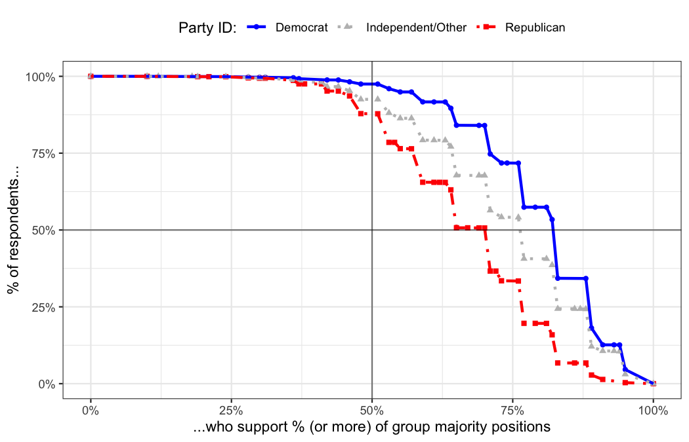

<!-- README.md is generated from README.Rmd. Please edit that file -->

# survalign 

<!-- badges: start -->

[](https://github.com/soubhikbarari/survalign/actions/workflows/R-CMD-check.yaml)
[](https://app.codecov.io/gh/soubhikbarari/survalign?branch=main)
[](https://github.com/soubhikbarari/survalign/blob/main/DESCRIPTION)
[](https://lifecycle.r-lib.org/articles/stages.html#experimental)
<!-- badges: end -->

**Democracy doesn’t work one issue at a time.**

**survalign** measures within-group alignment in survey data: how
unified a group’s members are cumulatively across a *basket of issues*,
not just one at a time.

Traditional issue-by-issue polling can make fractured coalitions look
cohesive. A group may show 60% support on each of five issues
separately, yet only 10% of its members agree on all five at once.
survalign quantifies this gap with a suite of alignment metrics.

## Key Metrics

Each metric captures a different facet of how cohesive a group is across
its full issue basket.

| Metric | Question it answers |
|----|----|
| **Alignment Mean** | On average, how aligned is a group member with the group majority across issues? |
| **Cumulative Weak Alignment** | What share of members agree on *at least half* of issues? |
| **Cumulative Perfect Alignment** | What share agrees on *every* issue? |
| **Issue Alignment** | How many issues *cumulatively* have majority support? |
| **Alignment Curve** | What share of the group supports what percent of issues? |

## Installation

Install the development version from GitHub:

``` r
# install.packages("pak")
pak::pak("soubhikbarari/survalign")
```

## Quick Example

Call `measure_alignment()` with a data frame, a regex matching your
question columns, and a grouping variable — it returns a `survalign`
object containing per-respondent scores, group-level statistics, and
everything needed for plotting.

``` r
library(survalign)
library(dplyr)

# Load bundled CES data
data(ces)

# Measure alignment on core policy items for 2024, by party
align <- ces |>
  filter(year == 2024) |>
  measure_alignment(
    ques_stem  = "(abort|immig|enviro|guns|military|trade)",
    group_col  = "pid3",
    id_col     = "id",
    verbose = FALSE
  )
```

## Visualize Alignment

`plot_cumulative_majority()` shows per-item and cumulative plurality
support side by side, making it easy to see where joint-issue agreement
breaks down even when individual-issue support looks high.

``` r
plot_cumulative_majority(align)
```


`plot_alignment_curve()` plots the share of group members who agree with
their group on at least *x*% of issues — a full distribution, not just a
single summary statistic.

``` r
plot_alignment_curve(align)
```



## Track Alignment Over Time

`measure_alignment_waves()` wraps `measure_alignment()` across survey
waves so you can track how group cohesion has shifted over time.

``` r
ces_align_waves <- ces |>
  measure_alignment_waves(
    ques_stem  = "(abort|immig|enviro|guns|military|trade)",
    group_col  = "pid3",
    wave_col   = "year",
    id_col     = "id",
    weight_col = "weight",
    verbose    = FALSE
  )

plot_group_stat_over_time(
  ces_align_waves,
  metric       = "cumulative_weak_alignment",
  wave_col     = "year",
  group_col    = "pid3",
  group_label  = "Party ID",
  group_colors = pid_colors
)
```


## Learn More

Full documentation and worked case studies are available on the [package
website](https://soubhikbarari.github.io/survalign/).

- [Understanding Group
  Alignment](https://soubhikbarari.github.io/survalign/articles/survalign.html)
  — conceptual explainer with toy data
- [CES Case
  Study](https://soubhikbarari.github.io/survalign/articles/case-ces.html)
  — partisan alignment in the Cooperative Election Study
- [GSS Case
  Study](https://soubhikbarari.github.io/survalign/articles/case-gss.html)
  — long-run trends in the General Social Survey
