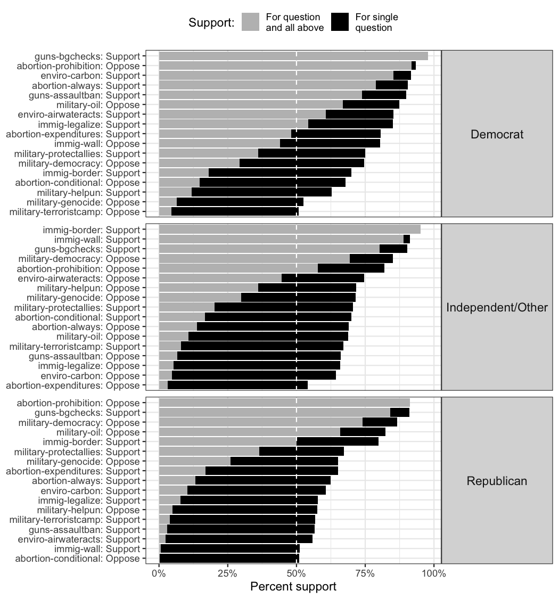
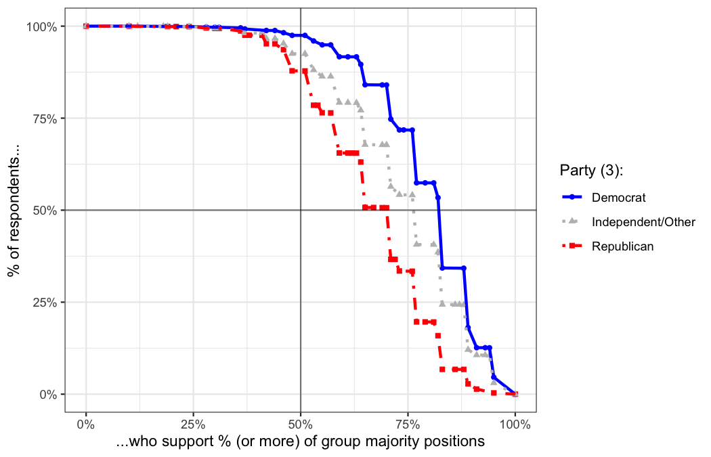
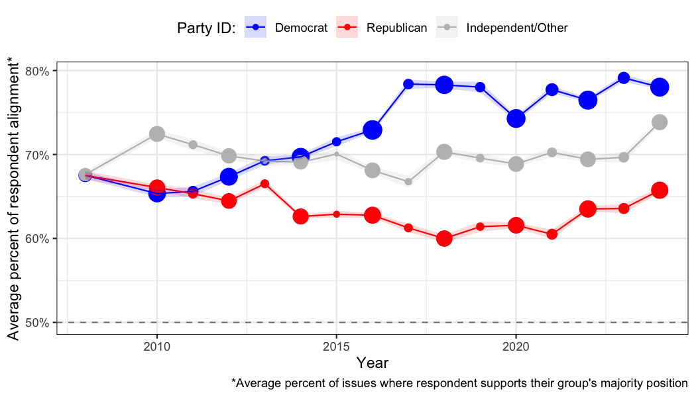

<!-- README.md is generated from README.Rmd. Please edit that file -->

# survalign 

<!-- badges: start -->

<!-- badges: end -->

**Democracy doesn’t work one issue at a time.**

**survalign** measures within-group alignment in survey data: how
unified a group’s members are across a *basket of issues*, not just one
at a time.

Traditional issue-by-issue polling can make fractured coalitions look
cohesive. A group may show 60% support on each of five issues
separately, yet only 10% of its members agree on all five at once.
survalign quantifies this gap with a suite of alignment metrics.

## Installation

Install the development version from GitHub:

``` r
# install.packages("pak")
pak::pak("soubhikbarari/survalign")
```

## Quick Example

``` r
library(survalign)
library(dplyr)

# Load bundled CES data
data(ces)

# Measure alignment on core policy items for 2024, by party
align <- ces |>
  filter(year == 2024) |>
  measure_alignment(
    ques_stem  = "(abort|immig|enviro|guns|military|trade)",
    group_col  = "pid3",
    id_col     = "id",
    verbose = FALSE
  )
```

## Visualize Alignment

``` r
plot_cumulative_support(align)
```



``` r
pid_colors <- c(Democrat = "blue", Republican = "red", `Independent/Other` = "grey")

plot_alignment_curve(align, group_colors = pid_colors)
```



## Track Alignment Over Time

``` r
ces_align_waves <- ces |>
  measure_alignment_waves(
    ques_stem  = "(abort|immig|enviro|guns|military|trade)",
    group_col  = "pid3",
    wave_col   = "year",
    id_col     = "id",
    weight_col = "weight",
    verbose    = FALSE
  )

plot_group_stat_over_time(
  ces_align_waves,
  metric       = "alignment_mean",
  wave_col     = "year",
  group_col    = "pid3",
  group_label  = "Party ID",
  group_colors = pid_colors
)
```



## Key Metrics

| Metric | Question it answers |
|----|----|
| **Alignment Mean** ($\bar{a}_g$) | On average, how aligned is a typical group member? |
| **Cumulative Weak Alignment** ($\alpha_g$) | What share of members agree on at least half of issues? |
| **Cumulative Perfect Alignment** ($A_g$) | What share agrees on *every* issue? |
| **Issue Alignment** | How many issues have genuine majority support? |
| **Alignment Curve** | What share of the group supports what percent of issues? |

## Learn More

- [Understanding Group
  Alignment](https://soubhikbarari.github.io/survalign/articles/survalign.html)
  — conceptual explainer with toy data
- [CES Case
  Study](https://soubhikbarari.github.io/survalign/articles/case-ces.html)
  — partisan alignment in the Cooperative Election Study
- [GSS Case
  Study](https://soubhikbarari.github.io/survalign/articles/case-gss.html)
  — long-run trends in the General Social Survey
